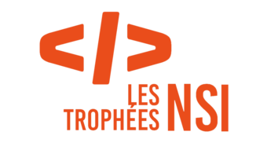

<div class="banner", align="center">
  
</div>

---

<div align="center">
  
  
  
</div>

---

<h1>PYTRIS (LIBRAIRIE PYGAME)</h1>
<p>Ce projet a été codé par <a href="https://github.com/periergeia">periergeia</a>, <a href="https://github.com/DominataurusRex">DominataurusRex</a> et <a href="https://github.com/BLASTUHQ">BLASTUHQ</a> pour le projet de deuxième trimestre de l'année scolaire 2021-2022 dans la spécialité NSI (Numériques et Sciences de l'Informatique) en <b>Python</b>.
  
<h2>Vous pouvez également trouver le serveur via ce répertoire : <a href="https://github.com/Jouca/Tetris-Server">Pytris Serveur</a></h2>

---

<div class="banner", align="center">
  


</div>
<h1 align="center">🏆 <ins>Lauréat national et dans l'académie d'Ile-de-France - Créteil</ins> 🏆</h1>

<h2 align="center">Pytris a été nominée par le <ins>jury national</ins> et par le <ins>jury de l'Académie de Créteil</ins> en tant que <ins>Meilleur projet de Terminale</ins> durant la première édition du concours "Les trophées NSI" en 2022.</h2>

---

<h1>PRÉREQUIS POUR L'INSTALLATION</h1>

<p>Afin de pouvoir installer le serveur, il vous faut au départ installer les modules suivants :</p>
<ul>
  <li>Pygame</li>
  <li>Requests</li>
</ul>

<p>Voici les commandes afin d'installer ces modules :</p>

```
>>> pip install pygame
>>> pip install requests
```

---

<h2>FICHIERS IMAGES UTILISÉS (dans ./image/):</h2>

Tous les fichiers images ont été dessinés par <a href="https://github.com/periergeia">periergeia</a> et <a href="https://twitter.com/hir0shi_gg">Hir0shi</a> (pour le logo du jeu)
- [back.png](./image/back.png)
- [bronze.png](./image/bronze_medal.png)
- [gold_medal.png](./image/gold_medal.png)
- [left_arrow.png](./image/left_arrow.png)
- [logo.ico](./image/logo.ico)
- [logo.jpg](./image/logo.jpg)
- [option.png](./image/option.png)
- [retry.png](./image/retry.png)
- [right_arrow.png](./image/right_arrow.png)
- [save.png](./image/save.png)
- [silver_medal.png](./image/silver_medal.png)
- [upload.png](./image/upload.png)

---

<h2>FICHIERS SON UTILISÉS (dans ./sound/):</h2>

- [click.wav](./sound/click.wav) de <u>dland</u> à l'adresse <a href="https://freesound.org/people/dland/sounds/320181/">https://freesound.org/people/dland/sounds/320181/</a> hebergé par freesound. Modification apportée --> fichier renommé.
- [korobeiniki.ogg](./sound/korobeiniki.ogg) arrangement et interprétation de la musique originale utilisé dans le jeu Tetris (de Nikolay Nekrasov écrit 1861) par <a href="https://github.com/periergeia">periergeia</a>
- [muhahaha.wav](./sound/muhahaha.wav) de <u>JPolito</u> à l'adresse <a href="https://freesound.org/people/JPolito/sounds/391726/">https://freesound.org/people/JPolito/sounds/391726/</a> hebergé par freesound. Modifications apportées --> conversion du fichier flac en wav avec convertio, fichier renommé.
- [pause_off.wav](./sound/pause_off.wav) de <u>jens.enk</u> à l'adresse <a href="https://freesound.org/people/jens.enk/sounds/434611/">https://freesound.org/people/jens.enk/sounds/434611/</a> hebergé par freesound. Modifications apportées --> conversion du fichier ogg en wav avec convertio, fichier renommé.
- [pause_on.wav](./sound/pause_on.wav) de <u>jens.enk</u> à l'adresse <a href="https://freesound.org/people/jens.enk/sounds/434610/">https://freesound.org/people/jens.enk/sounds/434610/</a> hebergé par freesound. Modification apportée --> conversion du fichier ogg en wav avec convertio, fichier renommé.
- [select.wav](./sound/select.wav) de <u>broumbroum</u> à l'adresse <a href="https://freesound.org/people/broumbroum/sounds/50561/">https://freesound.org/people/broumbroum/sounds/50561/</a> hebergé par freesound. Modification apportée --> fichier renommé.

---

<h2>LICENSE TETRIS:</h2>

Tetris® & © 1985~2022 Tetris Holding, LLC.<br>
Tetris logo, Tetris theme song and Tetriminos are trademarks of Tetris Holding, LLC.<br>
Licensed to The Tetris Company.<br>
Game Design by Alexey Pajitnov.<br>
Logo Design by Roger Dean.<br>
All Rights Reserved.

---

<h2>Veuillez apprécier le jeu !</h2>

Note: certaines fonctionnalités n'ont pas pu être codés dans les temps, le menu des options que l'on accède par la game pause (quand on met la gameplay sur pause) notamment ainsi que l'envoi des résultats sur le serveur pour mettre à jour le classement du menu des classement pour le moment fixe TvT
Veuillez nous excuser du manque et de la frustration eventuelle rencontrée, l'équipe travaille fort à l'amélioration du jeu ...
